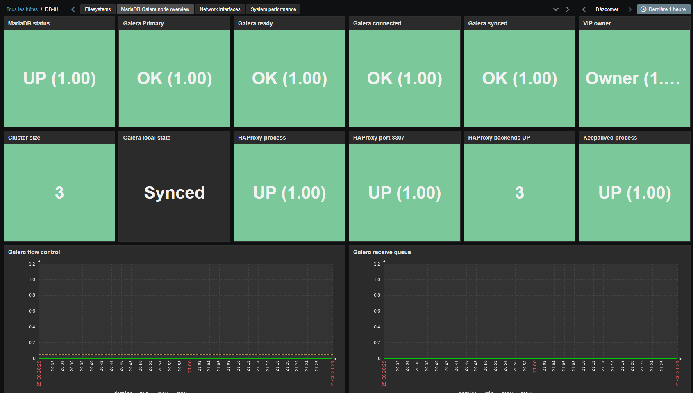

# Template Zabbix - MariaDB Galera + HAProxy + Keepalived


Ce paquet contient un template Zabbix pour 3 noeuds MariaDB Galera, chacun avec HAProxy et Keepalived.
Il supervise chaque noeud localement via `zabbix-agent` classique.



Fichiers du repo :

- `templates/template.yaml` : template a importer dans Zabbix.
- `zabbix_agentd.conf.d/agent.conf` : cles `UserParameter` pour `zabbix-agent`.
- `scripts/check.sh` : script de collecte appele par l'agent.

Chemins installes sur chaque noeud :

- `/usr/local/bin/galera-check.sh` : script de collecte.
- `/etc/zabbix/zabbix_agentd.conf.d/galera.conf` : configuration `UserParameter`.
- `/etc/zabbix/.my.cnf` : credentials MariaDB utilises par le script.

## Ce qui est supervise

- MariaDB local : `mysqladmin ping`.
- Galera local : Primary component, ready, connected, synced, cluster size, flow control, receive queue.
- HAProxy local : process, port TCP `3307`, et nombre de backends Galera UP vus par ce HAProxy.
- Keepalived local : process et presence de la VIP configuree dans la macro Zabbix `{$KEEPALIVED.VIP}`.

## Installation sur chaque noeud

Copier les fichiers :

```bash
sudo install -o root -g root -m 0755 scripts/check.sh /usr/local/bin/galera-check.sh
sudo install -o root -g root -m 0644 zabbix_agentd.conf.d/agent.conf /etc/zabbix/zabbix_agentd.conf.d/galera.conf
```

Installer les dependances :

```bash
sudo apt install -y mariadb-client socat iproute2 procps
```

Creer un utilisateur MariaDB de supervision :

```sql
CREATE USER 'zabbix-monitor'@'localhost' IDENTIFIED BY 'ChangeThisPassword';
GRANT PROCESS, REPLICATION CLIENT, SELECT ON *.* TO 'zabbix-monitor'@'localhost';
FLUSH PRIVILEGES;
```

Creer le fichier de credentials :

```bash
sudo install -o zabbix -g zabbix -m 0600 /dev/null /etc/zabbix/.my.cnf
sudo tee /etc/zabbix/.my.cnf >/dev/null <<'EOF'
[client]
user=zabbix-monitor
password=ChangeThisPassword
host=localhost
port=3306
EOF
sudo chown zabbix:zabbix /etc/zabbix/.my.cnf
sudo chmod 0600 /etc/zabbix/.my.cnf
```

## Configuration HAProxy requise

Le template lit l'etat des backends via le socket stats local. Ajouter dans `global` :

```haproxy
stats socket /run/haproxy/admin.sock user haproxy group zabbix mode 660 level admin
stats timeout 2s
```

Le script compte les backends `UP` dans le backend HAProxy nomme `galera_back`. Si votre backend HAProxy porte un autre nom, modifier la fonction `haproxy_backends_up_count` dans `/usr/local/bin/galera-check.sh`.

Redemarrer les services :

```bash
sudo systemctl restart haproxy
sudo systemctl restart zabbix-agent
```

Tester localement :

```bash
sudo -u zabbix /usr/local/bin/galera-check.sh mysql.ping
sudo -u zabbix /usr/local/bin/galera-check.sh galera.value wsrep_cluster_size
sudo -u zabbix /usr/local/bin/galera-check.sh haproxy.backends_up_count
sudo -u zabbix /usr/local/bin/galera-check.sh keepalived.vip.present 192.168.10.40
```

## Import Zabbix

1. Aller dans `Data collection` > `Templates` > `Import`.
2. Importer `templates/template.yaml`.
3. Lier le template aux 3 hosts Zabbix correspondant a `db-01`, `db-02`, `db-03`.
4. Verifier les macros du template :
   - `{$GALERA.EXPECTED_SIZE}` = `3`
   - `{$HAPROXY.MIN_BACKENDS_UP}` = `2`
   - `{$KEEPALIVED.VIP}` = adresse VIP Keepalived du cluster, par exemple `192.168.10.40`

Le dashboard inclus est optimise pour un cluster 3 noeuds avec au moins 2 backends HAProxy disponibles. Les triggers utilisent les macros ci-dessus. Les seuils de couleur du dashboard sont fixes pour eviter les erreurs d'import Zabbix sur les seuils avec macros.

## Dashboard inclus

Le template contient un dashboard pret a l'emploi :

```text
MariaDB Galera node overview
```

Il est importe avec le template et apparait comme dashboard de template sur chaque host qui utilise ce template.

Widgets inclus :

- Ligne statut cluster : MariaDB, Galera Primary, Ready, Connected, Synced, VIP owner.
- Ligne services locaux : cluster size, Galera local state, HAProxy process, port `3307`, backends UP, Keepalived process.
- Graphes Galera : flow control, receive queue, cluster size.
- Graphe HAProxy local : nombre de backends Galera UP vus par ce HAProxy.

## Savoir quel noeud porte la VIP

Dans `Latest data`, filtrer les 3 hosts du cluster et chercher :

```text
Keepalived: VIP <adresse VIP> present on this node
```

Le noeud qui retourne `VIP owner` ou `1` est le noeud qui porte actuellement la VIP.

En CLI sur chaque noeud, la meme information est disponible avec :

```bash
/usr/local/bin/galera-check.sh keepalived.vip.present 192.168.10.40
```

Retour attendu :

- `1` : ce noeud porte la VIP.
- `0` : ce noeud ne porte pas la VIP.

## Adapter si besoin

Si la VIP, le port HAProxy ou le chemin du socket changent, modifier les variables au debut de `/usr/local/bin/galera-check.sh` :

```bash
HAPROXY_SOCKET="${HAPROXY_SOCKET:-/run/haproxy/admin.sock}"
MYSQL_FRONT_PORT="${MYSQL_FRONT_PORT:-3307}"
```

Si le port frontend HAProxy change, modifier aussi la ligne correspondante dans `zabbix_agentd.conf.d/agent.conf` avant de recopier le fichier sur les noeuds.
